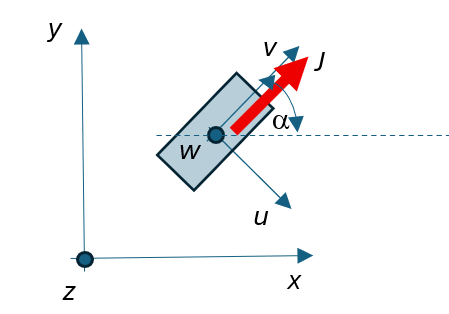

# Documentation

How to use the tool **Array_Dipoles_Shim** to find the optimal shimming configuration.
Similar to the code **Array_Dipoles**, PMs are assumed to have a parallelepiped shape defined by a local coordinate system {*u*,*v*,*w*}. The magnet polarization *J* is oriented along the local *v* axis.
The local coordinate system {*u*,*v*,*w*} is always located with axis *w* along the *z* axis of the global coordinate system. The magnet can be rotated in the *xy*-plane by an angle $\alpha$ (see the figure below). The geometrical data describing the PMs are detailed in section PM Input data.



## 1. Command line
The .exe version of the tool can be executed through the prompt command line as,
>Array_Dipoles_Shim <input_file>.toml

The optimization process is conceived to be executed in successive steps, starting from the optimal configuration reached in the previous execution (if any).

At each execution, the PM positions considered in the previous step are taken into account, adding new PMs in the available slots for each sector, in order to improve the homogeneity.

Results of the simulations are be stored in Matlab files under the Directory: <input_file><br>
See section 2.3.3 for information about the filenames.

## 2. Input file (.toml)


### 2.1 Header
The header includes a title and a version as a memo for the input data.

```toml
title = "Text case"
version = "1.0.0"
```

### 2.2 Unit section (optional)
The table `[unit]` is used to give the scale of ALL geometrical data.

The value `scale` is used to provide the numerical value of the scale.

If table [`unit`]  is not given, `scale` = 1 is assigned, that is all geometrical data are assumed to be in metres.

In the following example `scale` = 1e-3 means that all geometrical data are give in millimetres.

```toml
[unit]
scale = 1e-3
```


### 2.3 PM shimming section
The table `[shimming]` is used to define all the input data for the shimming process.

### 2.3.1 PM shimming measurement
The subtable `[shimming.measurement]` is used to define information about the input measurements in the DSV.

Value `filemis`: is a Matlab file which contains the B-field value measured in the DSV measurement points.

Value `component`: is the variable which define the component of the B-field to be considered for the computation of the field homogeneity in the DSV.

Value `typemis`: flag to identify volume measuremens (`typemis`='V') or surface measurements (`typemis`='S').

In the following example, the measurement values are in the file '..\DSV\20250418_inv_xy.mat'. The B-field component to be considered is the *x* one.

```toml
[shimming.measurement]
filemis = '..\DSV\20250418_inv_xy.mat'
component = 'x'
typemis = 'V'
```


## 2.3.2 PM shimming geometrical data

The subtable `[shimming.pm]` contains information about positions where the shimming PM can be placed.

Value `radius`: is the radius where the sectors containind the shimming PM can be located.

Value `Nsector_available`: is the number of available sectors for each ring.

Value `sector_type`: identifies the type of sector (see figure):
- sector_type = 1 (Rectangular sector)

  Value `sector_width` specifies the width of the rectangle.

- sector_type = 2 (Arc sector)

  Value `sector_angular_width` specifies the angular width of the arc.

Value `Nslot_per_sector`: Number of available positions for PM in each sector.

Value `ring_Zposition`: Z coordinate of each single ring.


In the following example, 12 sectors (`Nsector_available` = 12) are located at radius (*R*) equal to 234 mm (`radius` = 234). The sectors are rectangular ones (`sector_type` = 1), with width equal to 105 mm (`sector_width` = 105). The sector can contain a maximum of 5 PMs (`Nslot_per_section` = 5). 12 Rings are available in principle for placing sectors, with given position along *z* axis (`ring_Zposition`).<br>
All coordinates are assumed to be in millimetres, having previosly included the `[unit]` table, with `scale` = 1e-3.


```toml
[shimming.pm]
radius = 234
Nsector_available = 12
sector_type = 1
sector_width = 105
Nslot_per_section = 5
ring_Zposition = [9.875,29.875,49.875,69.625,89.875,109.626,129.875,149.625,187,-10.125,-30.125,-50.125,-69.875,-89.625,-109.625,-129.625,-149.625,-187]
```


## 2.3.3 PM shimming optimization data

The subtable `[shimming.opt_rules]` contains information about how to perform the optimization.

Value `PM_AngleVar`: defines the limits of variation of the magnet angle from a minimum to a maximum. Typically these two values are set to 0° and 360° (`PM_AngleVar` = [0,360]), respectively.
Anyway, a larger variation can be adopted to enable the algorithm to accept the absence of some PMs. When the angle variation is stochastically set greater than 360, it means that the PM is not present. As an example, if `PM_AngleVar` = [0,720], it means that when the extracted variable is lower than 360 the PM is present with the corresponding angle. When the extracted variable is between 360 and 720 the PM is not present. 

Value `PM_size`: Dimensions of the PM along the local coordinate system {*u*,*v*,*w*}.

Value `PM_material`: Material code to be considered for the PMs.


Value `ring_to_be_used`: list of rings to be used in the optimization process. If this variable is not given, all rings are used.

Value `sector_to_be_used`: list of sectors where the PM should be located during the optimization process. If this variable is not given, all sectors are used.

Value `slot_to_be_used`: list of slots within each sector where the PM should be located during the optimization process. If this variable is not given, all slots are used.

Value `dev_to_be_optimized`: homogeneity metric to be considered in the optimization ('DEV1','DEV2','DEV3',or 'dB'). 'DEV1' and 'DEV2' are applicable for `typemis` = 'V'. 'DEV2' is applicable for `typemis` = 'S'. 'dB' is applicable for both.

Value `ending_state`: define the name of the Matlab file to store the result of the optimization.

Value `restart`: logical value to define to start from a previous optimization.

if `restart` = true

   Value `starting_state`: define the name of the Matlab file which contains the result of the previous optimization process.

Value `Global_Algorithm`: Define the type of Global Optimization algorithm. Values are: `GA` Genetic Algorithm, `SW` Particle Swarm Optimization Algorithm, `SA` Simulated annealing Optimization Algorithm, `WO` Whale Optimization Algorithm.

Value `Local_Algorithm`: Define the type of Local Optimization algorithm. 
Values are:  `PS` Patternsearch Optimization Algorithm, `FM` Fmincon Optimization Algorithm, `LSQ+MC` Least Square combined with Montecarlo, `PS+MC` Patternsearch combined with Montecarlo, `FM+MC` Fmincon combined with Montecarlo, `MC` pure Montecarlo.

Value `Tolerance`: parameters of the optimization Matlab algorithms.

For the 'GA' algorithm the following additional parameters can be set:

Value `MaxGenerations1`, Value `MaxStallGenerations`, Value `PopulationSize`.

Value `MutationRate` defines the mutation rules for ga algorithm. If `MutationRate` = 0, the default Gaussian mutation function is adopted. If `MutationRate` > 0 the uniform function is used as mutation function with rate equal to the value `MutationRate`.


In example 1, the PMs are cubic with size (12x12x12) mm<sup>3</sup> of material code 1.<br>
Only the first three rings (1,2,3) can be used.<br>
Only sectors (1,4,7) can be used.<br>
Only slots (2,4) can be used.<br>
All coordinates are assumed to be in millimetres, having previosly included the `[unit]` table, with `scale` = 1e-3.<br>
The metric to be optimized is DEV1. The optimization starts from scratch (`restart` = false) and store the results in Matlab file 'Run1.mat'.


Example 1

```toml
[shimming.opt_rules]
PM_size = [12,12,12]
PM_material = 1
ring_to_be_used = [1,2,3]
sector_to_be_used = [1,4,7]
slot_to_be_used = [2,4]
dev_to_be_optimized='DEV1'
ending_state='Run1.mat'
restart=false
starting_state='Run1.mat'
MaxGenerations1=100
MaxStallGenerations=50
Tolerance=1e-4
Global_Algorithm='GA'
```

In example 2, the PMs are cubic with size (12x12x12) mm^{3} of material code 1.<br>
The six mor internal rings (1,2,3 and 10,11,12) can be used.<br>
All coordinates are assumed to be in millimetres, having previosly included the `[unit]` table, with `scale` = 1e-3.<br>
The metric to be optimized is DEV1. The optimization starts from previous execution (`restart` = true), reading results from file 'Run1.mat'. At the end of the execution, the results are stored in Matlab file 'Run2.mat'.

Example 2

```toml
[shimming.opt_rules]
PM_size = [12,12,12]
PM_material = 1
sector_to_be_used = [1,3,5,7,9,11]
ring_to_be_used = [1,2,3,10,11,12]
slot_to_be_used = [2,4]
dev_to_be_optimized='DEV1'
ending_state='Run2.mat'
restart=true
starting_state='Run1.mat'
MaxGenerations1=100
MaxStallGenerations=50
Tolerance=1e-4
```


### 2.4 Material data section
The table `[material]` is used to describe the PM magnetic material properties.

Value `JHcurve`: logical data which determines if nonlinear magnetic properties are given.

- `JHcurve` = true (nonlinear behaviour)
   
   Value `files`: list of filenames with the *H-J* curves of the PM materials (one file for each material code)
   
   Value `tref`: reference temperatures (in celsius degrees) corresponding to the *H-J* curves described in the previous files (one value for each material code)
   
   Value `jvt`: coefficients (one value for each material code) for linear rescaling values of residual polarization $J_r$, as

   $J_r=J_{ro}\,(1+a\,(T-T_{ref}))$
   
   where
   
   $J_{ro}$ is the residual polarization of the *H-J* curve at the reference temperature $T_{ref}$ as given in value `tref`

   $a$ is the value of the coefficient given in value `jvt`.
   
   
   Values `hvt1,hvt2`: linear and quadratic coefficients (one value for each material code) for rescaling values of coercive field $H_c$


   $H_c=H_{co}\,(1+b\,(T-T_{ref})+c\,(T-T_{ref})^2)$
   
   where
   
   $H_{co}$ is the coercive field of the *H-J* curve at the reference temperature $T_{ref}$ as given in value `tref`

   $b$ is the value of the coefficient given in value `hvt1`.

   $c$ is the value of the coefficient given in value `hvt2`.


- `JHcurve` = false (linear behaviour)

   Value `MuR`: relative permeability $\mu_R$ of the PM materials (one value for each material code), as
   
   $B = \mu_o H + J = \mu_o H + J_r + \mu_R \mu_o H$
   
   Value `Jresidua`: residual polarization $J_r$ (in tesla) of the PM materials (one value for each material code)


In the following example the nonlinear material properties data are given (for two materials).

```toml
[material]
JHcurve = true
files = ['<Dir>\<FileMat1>.txt',
         '<Dir>\<FileMat2>.txt']
tref = [18,18]
jvt = [-0.001263,-0.001263]
hvt1 = [-1e-2,-1e-2]
hvt2 = [3.8e-5,3.8e-5]
```

In the following example the linear material properties data are given (for two materials).

```toml
[material]
JHcurve = false
MuR = [0.0223,0.0168]
Jresidua = [1.4311,1.4616]
```


## 2.4.1 *H-J* magnetization curves (.txt)

The .txt file listed in table `[material]` for providing the *H-J* magnetization curves are structured as described below.

```txt
H1,J1
H2,J2
.....
```

The values are the couples of *H* (in A/m),*J* (in T) values starting from the coercive field up to saturation. They are so ordered in ascending way.

In the following example the description of a *H-J* curve starting from a coercive field equal to -9.4116e+05 A/m up to the point H = 5.3198e+05 A/m and J = 1.4728 T.

```txt
-9.4116e+05,0
-9.4069e+05,0.0047
-9.4045e+05,0.0126
-9.4037e+05,0.0233
-9.4021e+05,0.0477
.....
5.2975e+05,1.4715
5.3054e+05,1.4717
5.3094e+05,1.4719
5.3198e+05,1.4728
```


### 2.5 PMs Temperature section
The table `[temperature]` is used to describe the temperature status of the PMs.

Value `type`: code describing the temperature status of PMs


- `type` = 0: all PMs are at the reference temperature (no modification of the material data)
- `type` = 1: all PMs are at the same temperature (given by `value`). The *H-J* curves are modified accordingly to the `jvt` and `hvt1`,`hvt2` coefficients
- `type` = 2: each PM has a different temperature (as listed in the .csv file). The *H-J* curve of each PM is modified accordingly to the `jvt` and `hvt1`,`hvt2` coefficients

In the following example, all PMs are assumed to have a temperature value of 23 °C.

```toml
[temperature]
type = 1
value = 23
```
In the following example, each PMs has a temperature value as listed in the .csv file (see section 2.5.1).

```toml
[temperature]
type = 2
file = '<Dir>\<FileT>.csv'
```

### 2.5.1 Structure of the .csv file

The file containing the temperature value associated to each PM is provided by a .csv structure data file. This is a usual output of simulation tools based on Finite Element software (es. Dassault CST).


The file is structured as described below. The order of the data is coherent with the PM numbering, as described in the table [.pm].

```txt
#x [unit];y [unit];z [unit]; [°C]
171;0;10;36.327126
169.96;18.81;10;36.324699
166.86;37.39;10;36.353817
.....
```
After the header, for each PM the values of the *x*, *y*, *z* coordinates and the corresponding value of temperature are given.  Data are separated by semi-colons.


### 2.6 Simulation data section

The table `[simul]` is used to define the simulation input/output data

Value `type`: type of simulation
- `type` = ONLY 'det' deterministic simulation is considered.

Value `component`: cartesian component of the *B* field to be considered ('*x*', '*y*' or '*z*'). Also the magnitude ('*mag*') can be selected.

Value `reaction`: flag to activate or deactivate the PM reactions.

Value `NL`: flag to activate or deactivate the nonlinear simulation.

In the following example a deterministic simulation is done, activating the PM reaction and the nonlinear PM characteristics.
The output value is the *x* component of the *B* field.
Outputs are stored in file 'test.mat'

```toml
[simul]
type = 'det'
component = 'x'
reaction = true
NL = true
```
